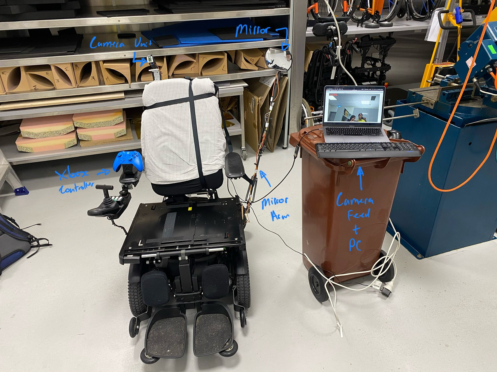

# rpi-fov

Raspberry Pi Field of View (FOV) Project for BIOE6901

For the user manual & code documentation regarding the prototype please see the README in -  [FOV Expansion Device](https://github.com/aburo8/rpi-fov/tree/main/ab-prototype-v1).



## Folder Structure

```bash
.
├── Mechanical Files - Raspberry Pi Case Mechanical Files
├── README.md
├── ab-prototype-v1 - Folder Containing the contents of the final prototype
│   ├── README.md - Code Documentation & User Manual
│   ├── ab_prototype.py - V1 Prototype
│   ├── ab_prototype_v2.py - Final Prototype
│   ├── assets - Documentation assets
│   ├── data - OpenCV Haar Cascade Data
│   ├── fov.service - System Service Script
│   ├── launch_fov.sh - Launch Script
│   ├── mechanical_files - Mechanical Design Files
│   ├── stack.py - Custom stack implementation
│   ├── test-scripts - Test scripts verify functionality & debug
└── ss_prototype_v1 - Shreya's Initial Prototype
```
