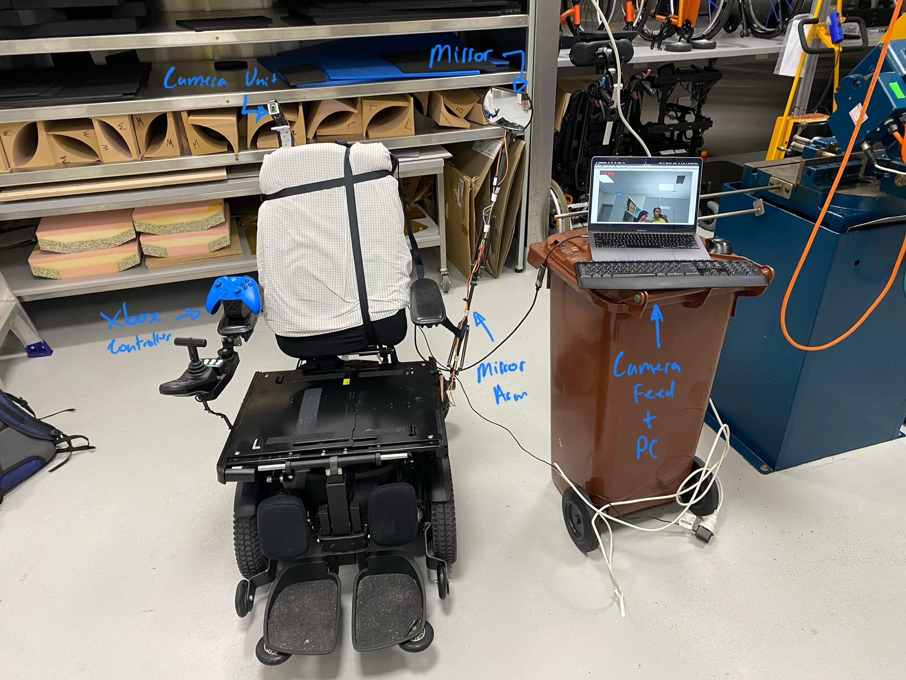
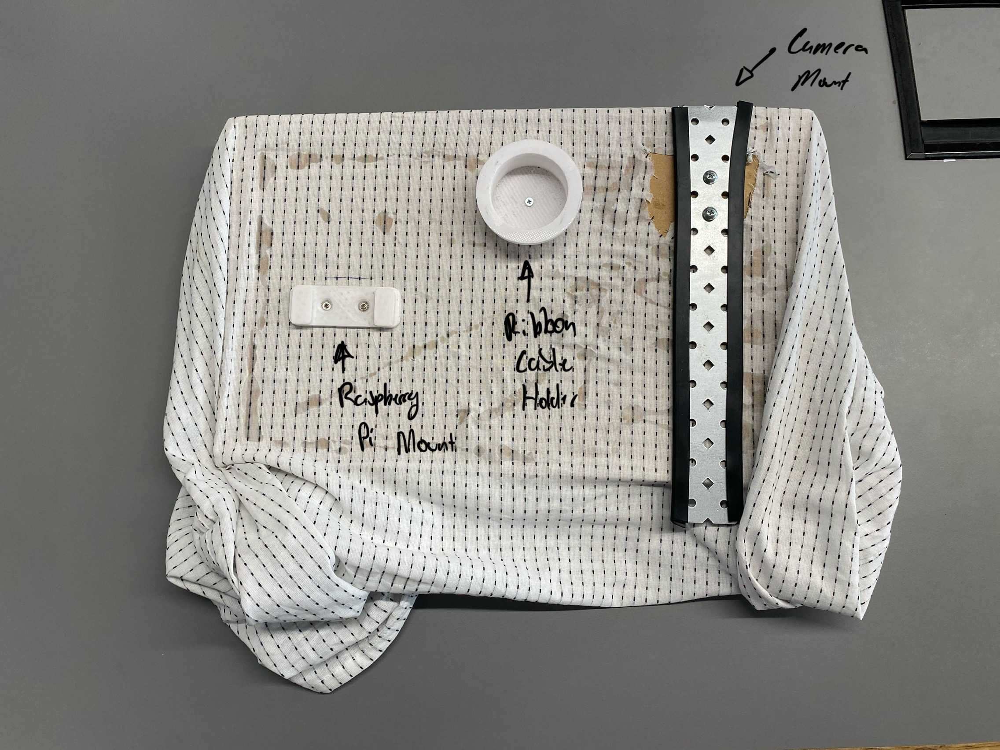
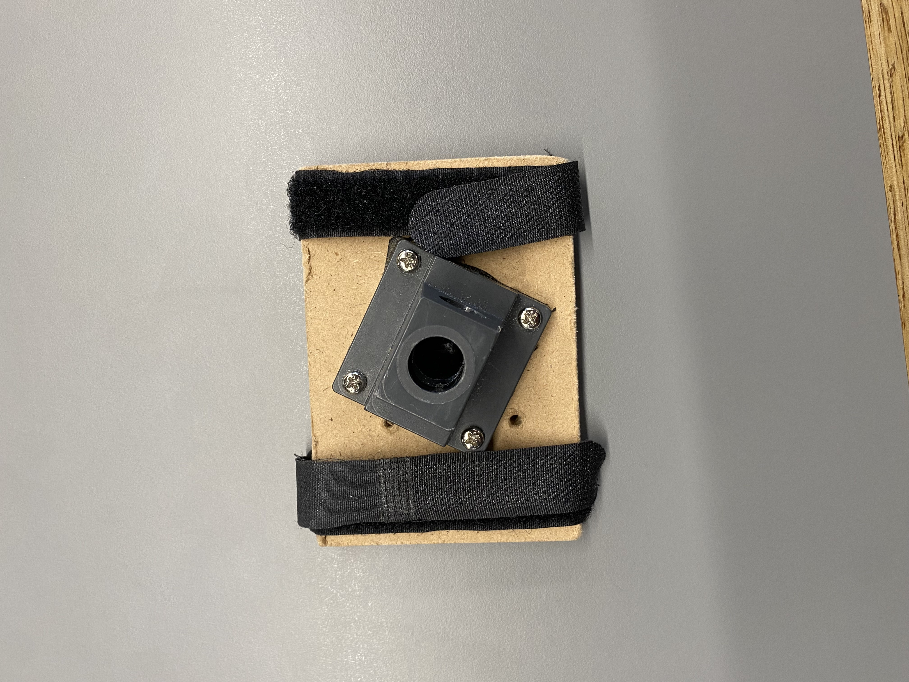

# FOV Expansion Device

FOV Expansion Device Prototype Developed by Alexander Burovanov.

## Device User Manual (General Purpose)

This is a user operating manual for the FOV Expansion System developed for the STARS NRM FOV project. The developed device is a camera controlled mirror system which expands the FOV of the user.



### 1. Getting Started

This project is an FoV expansion prototype for BIOE6901. To get started first ensure you have the following hardware ready:

- Mirror Arm (with wiring harness attached)

- Raspberry Pi Control Unit + Attached Raspberry Pi Camera Module

- Rear Control Panel + Attached Camera Mount

- System Wiring Harness (Attached to Mirror Arm and Camera Mount)

- 1 x Mirror Arm Base with 2 x Mounting Straps

- 3 x Control Panel Mounting Straps

- 1 x XBOX One Bluetooth Controller

- 1 x USB-C Power Cable + Inline Power Switch


*Note: these instructions assume that the latest version of the rpi-fov controller firmware have already been flashed to the device. For help flashing new firmware, see the [Software User Manual](#software-user-manual-engineers-only).*

### 2. Assembly/Mounting

To assemble the device and mounting it to the chair follow the following steps:

1. Take the Mirror Arm Base Plate and secure it to the chair armrest or rail using the two provided arm mounting straps.
2. Insert the Mirror Arm into the base plate. *NOTE: this mirror arm should have the mirror and the wiring harness attached to it, it should be handled with caution.* If the mirror is not yet attached to the arm, attach the mirror by sticking it into place with the provided bluetac.
3. Place the rear chair control panel board over the back rest of the wheelchair. *NOTE: that this control panel has the camera mount and controller unit mount already pre-installed.*
4. Using the provided rear panel mounting straps, secure the rear control panel to the chair. *NOTE: that not all straps are required. It depends on the chair type and mounting configuration. This is left to the users discretion.*
5. Mount the raspberry pi control unit to the rear control panel by sliding it into the rails located on the left of the control panel.
6. Take the camera module (attached to the Raspberry Pi control unit) and slide it into the white housing unit located at the top of the camera pan/tilt assembly.
7. Slide the camera pan/tilt assembly onto the camera mount (attached to the rear control panel). *Note: the direction matters here, please ensure the black ribbon connector (connected to the camera) is protruding from the back of the camera mount!*
8. Connect the wiring harness (attached to the mirror arm and the camera pan/tilt assembly) to the raspberry pi control unit if it is not already connected. If the device is already connected please **DOUBLE CHECK** that the device connections match the following images -


9. Connect the USB-C power cable to the Raspberry Pi Control Unit.
10. Unfortunately, due to the custom installation nature of this device, we have had to allow for additional slack within the wiring harness so it can be mounted on different types of wheelchairs. Use the provided reusable cable ties to improve the wire management and securely mount the wiring harness to the device.

At this stage the device is now securely mounted to the device and is ready for Power on, see [3. Powering On The Device](#3-powering-on-the-device).

### 3. Powering on the Device

In order to power on the device follow the following steps:

1. Power on the Xbox One Bluetooth Controller by pressing the XBOX logo for 1-2 seconds. The device logo will then begin to flash.
2. Power on the FOV Expansion device by pressing the power button on the USB-C power cord. Ensure that power has been provided to the device. To check that the device is powered on successfully, a solid red light status indicator light will appear on the top right of the Raspberry Pi Control Unit.
3. Wait for the device to boot and the XBOX Controller to connect. This process usually takes 20-60 seconds. Once the controller is connected the XBOX Logo light will stop flashing and remain on.
4. If the controller did not connect successfully or the device did not boot, please repeat steps 1-3 before proceeding.
5. Power on the pan/tilt servo assemblies, by plugging in the power pack attached to the wiring harness.
6. The device is now ready for operation. See [4. Operating the Device](#4-operating-the-device).

#### Troubleshooting

If you encounter any issues with these steps first try replacing the batteries in the Xbox controller. There is no battery indicator on the device and the connection will become unreliable if the controller has low battery.
If problems persist contact the engineer who programmed your control unit.

### 4. Operating the Device

The FOV Expansion device is operated by the Xbox One Bluetooth Controller. The device has two operation modes manual mode and automatic mode.

#### Manual Mode

When first powering on the FOV Device, by default you are put into manual mode. Manual mode allows you to control the position of the mirror using the Left Joystick on the Xbox One Controller. When manually controlling the mirror there are two movement options `Increment` and `Position`. By default the device will be in `Increment` mode, meaning that when you move the joystick the mirror moves in increments and remains in a fixed position. `Position` mode is the opposite of this where the mirror moves to the current position of the joystick at all times. This means that if you move the joystick to the left the mirror will rotate left, then when you release the joystick back into the centre the mirror will follow it back to the centre. You can press `B` on the controller, to toggle between `Increment` and `Position` movement controls.

In the current configuration of the device, there is not much merit to being able to move the camera system, however to ensure compatibility with other output systems such as a screen, the user also has the ability to move the position of the camera system using the joystick. To toggle between moving the Camera system and the Mirror, press `Y` on the controller.

*Note: the movement mode selected will persist when toggling between Camera and Mirror control.*

#### Automatic Mode

The FOV Expansion device also has an automatic control mode, this is where the camera system mounted to the top of the chair can be used to automatically control the position of the mirrors. This is done by tracking the faces of individuals you are interacting with. To toggle between `Automatic` and `Manual` operation modes press the `A` button on the controller. Please note, once you are in `Automatic` mode, if you move the joystick, you will automatically be placed back into `Manual` mode.

*WARNING: This is a prototype, automatic mode is not perfect. Please use it under advisement and revert to manual mode as required.*

### 5. Powering off the Device

To power off the device follow the below steps:

1. Press the power button on the USB-C Power Cable.
2. Disconnect the wiring harness power pack from the power source.
3. Once the device is fully powered off, the red status indicator on the Raspberry Pi will be off.
4. Note, that the XBOX Controller will automatically power itself off now that it is no longer connected to the control unit.

### 6. Dismounting & Storing the device

To dismount and store the FOV Expansion device please follow these instructions -

*WARNING: in the current prototype, various measures have been taken to ensure the portability of the device. However, it is still a prototype so extreme caution should be taken when dismounting the device.*

1. Enure that the device has been successfully powered off. See [5. Powering off the Device](#5-powering-off-the-device).
2. Disconnect the USB-C Cable power cable from the device.
3. Here you have the option to (A) store the control panel, control unit & mirror arm together or (B) store the control panel & mirror arm together and the control unit and camera separately.

    For Option (A):

    1. Detach the control panel mounting straps from the chair.
    2. Remove the mirror arm from the base (done by pulling it out from the front of the chair) and collapse it using the 3 adjustable screw dials on the arm. *Note: the wiring harness is still attached to this arm so this must be done in close proximity to the chair.*
    3. Remove the Rear Control Panel from the chair. *Note, that this should have the camera mount, control unit, and wiring harness attached to it.*

    For Option (B):

    1. Disconnect the wiring harness from the raspberry pi control unit.
    2. Disconnect the camera from the camera mount by sliding the green camera module board out of the top of the white enclosure.
    3. Remove the Raspberry Pi control unit from the control panel by sliding it out of the rail mount.
    4. The Raspberry Pi control unit and the camera module can now be stored.
    5. Detach the control panel mounting straps from the chair.
    6. Remove the mirror arm from the base (done by pulling it out from the front of the chair) and collapse it using the 3 adjustable screw dials on the arm. *Note: the wiring harness is still attached to this arm so this must be done in close proximity to the chair.*
    7. Remove the Rear Control Panel from the chair. *Note, that this should have wiring harness attached to it.*
4. Detach the mirror arm base from the chair by loosening the two mounting straps.
5. Store the device in the medium of your choosing.

## Software User Manual (Engineers Only)

This manual explains the firmware architecture of the FOV Device. It is not exhaustive and is for the use of the developers only. Only perform these actions under the advisement of a STARS NRM FOV engineer.

## Running the Code

The program which is driving this Final prototype is the `ab_prototype_v2.py` script. The program which is was used for AB Prototype 2 can be seen in the `ab_prototype.py` file.

To run this program on the Raspberry Pi, first install the following packages into your python environment -

- evdev
- pigpio

Once installed the Python programs can be run on the Raspberry Pi. 

### Final Prototype Code (ab_prototype_v2.py)

When running `ab_prototype_v2.py`, there are various command line flags that can modify the way the program runs.

`--headless` will run the program in a headless state. This means that no visual of the camera feed will be rendered.

`--draw` will process image frames sequentially, and detected face bounding boxes onto the screen.

`--sync_cam` will sync the camera pan/tilt assembly to the same position as the mirror. This worked well when the mirror was mounted further in front of the char, but results degraded after moving the mirror position. **This mode should only be used under advisement.**

To start the program normally, run the following commands in a terminal window -

```bash
cd rpi-fov/ab-prototype-v1/
python ab_prototype_v2.py # You can pass any additional command line flags here
# Call -h flag for help.
```

## Raspberry Pi Control Unit Setup

To prepare the provision the Raspbery Pi control unit, the following actions must be taken:

1. Library Install
2. Controller Pairing
3. Auto-Launch

### Python Environment Setup

To setup the microcontroller to run the `ab_prototype_v2.py` application, the following python libraries must first be installed on your raspberry pi with the `apt` package manager:

- python3-evdev
- python3-numpy
- python3-opencv
- picamera2

*Note: this is done by running `sudo apt install python3-{package_name_here}`*

Additionally the PWM signals for the actuators within the protoype are controlled with the `pigpio` library. This comes preinstalled on the raspberry pi but it must be configured to start at launch. See the following commands -

```bash
# AUTO-START
# To set pigpio to automatically start at Pi boot
sudo systemctl enable pigpiod

# Now restart your raspberry pi to start the service or alternatively to avoid a restart you can call
sudo systemctl start pigpiod 

-------------------------------------------------------
# Single Session Start
# To start pigpio for a single session
sudo pigpiod

# To stop pigpio (if you wish)
sudo systemctl stop pigpiod
```

### Controller Pairing

To pair an Xbox Controller input device with the Raspberry Pi Control Unit, first open a terminal window, then follow the steps below -

```bash
sudo bluetoothctl # This will open a Bluetooth Control Prompt

scan on # This will begin Bluetooth scanning

# Now put your Xbox controller into pairing mode by holding down the Xbox Logo button and the pairing button (located on the back of the controller next to the micro-usb connector)

# Once in pairing mode you will see the Xbox Controller advertise itself on the Bluetooth terminal, note down it's MAC address

# For the purposes of demonstration, assume my Xbox Controller has a MAC address of 5F:13:A1:C8:D5

# Run the following commands - 
pair 5F:13:A1:C8:D5 # Pair the Controller

connect 5F:13:A1:C8:D5 # Connect to the Controller

trust 5F:13:A1:C8:D5 # Trust the controller

# The controller is now connected and is configured to automatically reconnect to this Raspberry Pi controller. Press `CTRL-D` to exit the Bluetooth prompt.
```

To test that the Bluetooth Controller is successfully connected run the `evtest` command from your terminal. You should see the Xbox controller appear as a listed input device. If you select the controller within `evtest` and move the joysticks, you will now see the HID events be printed to the display.

*Note: this is not installed by default on the pi, you will need to run `sudo apt-get install evtest`*

### Auto-Launch

To configure the program to automatically launch when the raspberry pi is connected to power, a system service was added. Follow execute the following commands from the terminal to configure the program for auto-launch.

*Note: you will need to update the `fov.service` and `fov_launch.sh` scripts with the appropriate installation path before continuing.*

```bash
# Change to code directory
cd rpi-fov/ab-prototype-v1/

# Copy the fov.service file to systemd
sudo cp fov.service /etc/systemd/system/fov.service

# Add enable the fov.service (so it runs as a system service)
sudo systemctl enable fov.service

# Autostart is now configured
```

Since the prgoram runs as part of the system daemon, you can also control it using the following commands -

```bash
# To Start/Restart/Stop the Fov service
sudo service fov {start|stop|restart}

# To check the current status of the fov service
systemctl stauts fov
```
